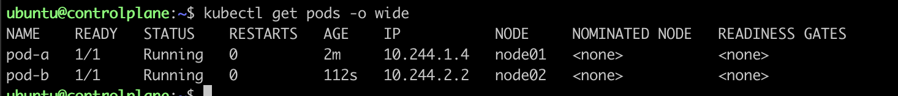
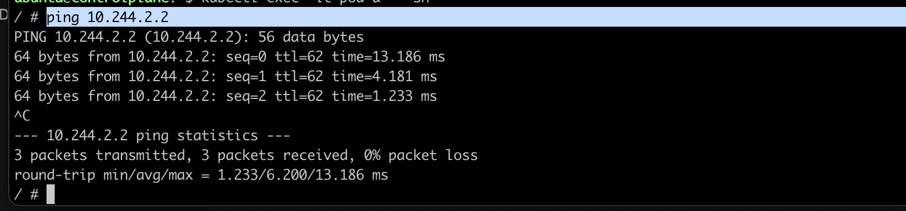
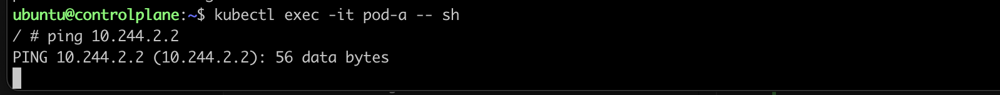

To install CNI Plugin Antrea run

```bash
kubectl apply -f https://github.com/antrea-io/antrea/releases/latest/download/antrea.yml
```
on controlplane.

# Pod-to-Pod-communication between Nodes

Then copy `pod-a.yaml` and `pod-b.yaml` files and run
```bash
kubectl apply -f pod-a.yaml
```
and
```bash
kubectl apply -f pod-b.yaml
```
to deploy two pods on diferent nodes.

Now, there are two pods. Run
```bash
kubectl get pods -o wide
```
to find out the ip adresses.

[](img/get-pods.png)

Get into the pod a with command
```bash
kubectl exec -it pod-a -- sh
```
and ping pod b with command
```bash
ping <IP-ADDR>
(in my case 10.244.2.2)
```
[](img/ping.png)

# Network policy

Copy `netpol.yaml` file and run
```bash
kubectl apply -f netpol.yaml
```
to apply the policy. After that try the same thing - get into the pod a and ping the pod b.

[](img/blocked.png)
